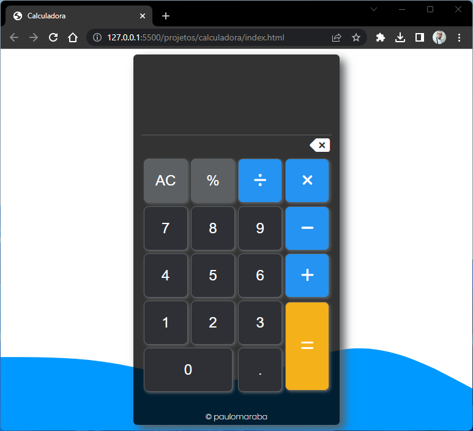
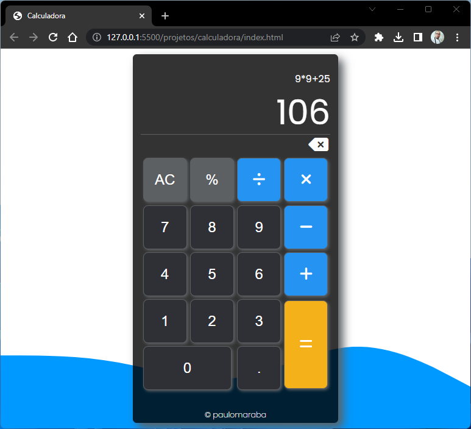

:date: Calculadora

Tecnologias | Projeto | Observações| Imagens | Licença

## :hammer_and_wrench: Técnologias
Esse projeto foi desenvolvido com as seguintes tecnologias:

- HTML5
- CSS3
- JavaScript
  
## :moyai: Projeto

Esse projeto foi desenvolvido com base em um tutorial no Youtube, foi realizando algumas poucas alterações na estilização e funções a mais. Consiste em uma simples calculadora para que eu pudece por em prática alguns poucos conhecimentos e esse readme, para testar algumas funcionalidades do Markdown.

## :pencil2: Observações

Algumas funcionalidades, ainda não estão funcionando, estarei realizando alterações ao longo que consigo adquirir mais conhecimento em JavaScript.
Se alguém souber como fazer a função de porcentagem funcionar e funções para limpar a tela, fique a vontade, ficarei muito grato pela ajuda.

## :framed_picture: Imagens

## :page_with_curl: Licença
Esse projeto está sob a licença MIT.
Veja aqui a <a href="https://opensource.org/license/mit/" target="_blank">LICENCE</a> para mais detalhes